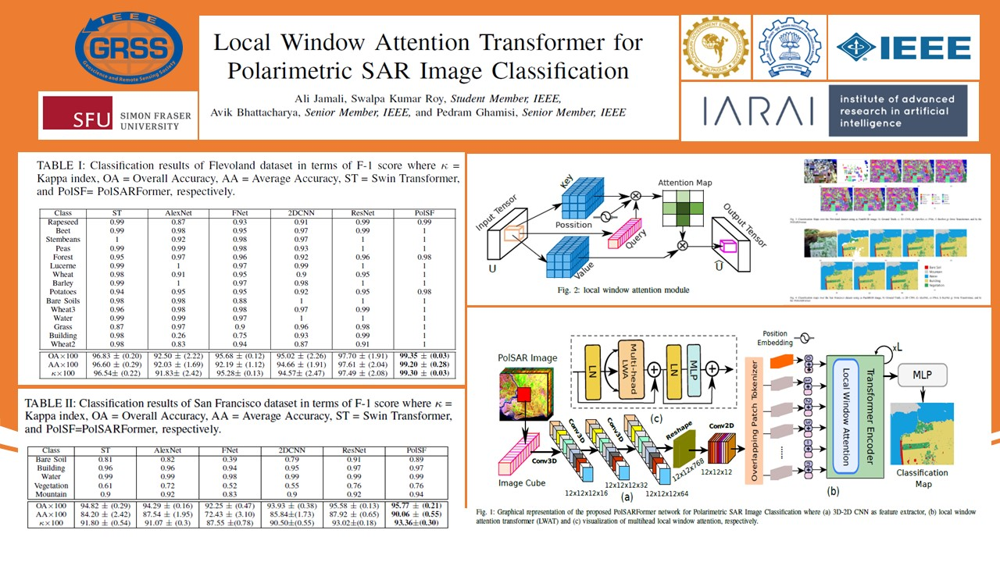

# PolSARFormer: Local Window Attention Transformer for Polarimetric SAR Image Classification

[Ali Jamali](https://www.researchgate.net/profile/Ali-Jamali), [Swalpa Kumar Roy](https://swalpa.github.io), [Avik Bhattacharya](http://www.mrslab.in/Avik/), and [Pedram Ghamisi](https://www.iarai.ac.at/people/pedramghamisi/)

___________

This Keras code is for the paper A. Jamali, S. K. Roy, A. Bhattacharya and P. Ghamisi, "[Local Window Attention Transformer for Polarimetric SAR Image Classification](https://github.com/aj1365/PolSARFormer/blob/main/main.pdf)," in IEEE Geoscience and Remote Sensing Letters, doi: 10.1109/LGRS.2023.3239263 [https://ieeexplore.ieee.org/document/10024822].

---------------------
### Dataset

Flevoland dataset: NASA/JPL AIRSAR recorded the data of Flevoland, situated in the Netherlands, on August 16, 1989. 
The Flevoland image is $750\times1024$ pixels in size.

San Francisco dataset: The San Francisco illustrates a NASA/JPL AIRSAR L-band image of the San Francisco area. 
The resolution of the data of the San Francisco is $900\times1024$ pixels.

Citation
---------------------

**Please kindly cite the paper if this code is useful and helpful for your research.**

  @article{jamali2023local,
    title={Local window attention transformer for polarimetric SAR image classification},
    author={Jamali, Ali and Roy, Swalpa Kumar and Bhattacharya, Avik and Ghamisi, Pedram},
    journal={IEEE Geoscience and Remote Sensing Letters},
    volume={20},
    pages={1--5},
    year={2023},
    publisher={IEEE}
  }

Acknowledgement
---------------------

Part of the local window attention (LWA) block is implementated from [Neighborhood Attention Transformer](https://github.com/SHI-Labs/Neighborhood-Attention-Transformer). 

## License

Copyright (c) 2023 Ali Jamali. Released under the MIT License. See [LICENSE](LICENSE) for details.
